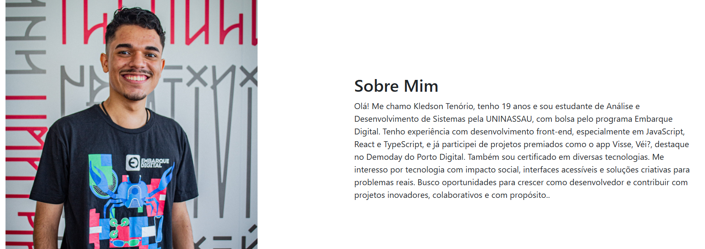

# Portfólio Pessoal 💼

Este é o meu portfólio pessoal, desenvolvido como atividade prática da disciplina de Fundamentos de Programação. O objetivo foi adaptar um template fornecido e personalizá-lo com minhas informações, exercitando HTML, CSS e a criatividade no desenvolvimento web.

## 🔍 Sobre Mim

Olá! Me chamo **Kledson Tenório**, tenho 19 anos e sou estudante de Análise e Desenvolvimento de Sistemas pela UNINASSAU. Sou bolsista do programa Embarque Digital pelo Porto Digital e participei de diversos projetos, como o **Visse, Véi?**. Este portfólio representa meus primeiros passos na programação web.

---

## 🖼️ Telas do Portfólio

### Tela Inicial 🏠


### Sessão Sobre Mim 👤



---

## ⚙️ Requisitos para rodar o projeto

Para visualizar o projeto corretamente, você precisa de:

- Navegador web atualizado (Chrome, Firefox, Edge, etc.)
- Não é necessário instalar nada: basta abrir o arquivo `index.html` com um navegador

---

## 🚀 Como rodar

1. Faça o download do projeto ou clone este repositório:
   ```bash
   git clone https://github.com/KledsoN1/portifolio-pessoal
